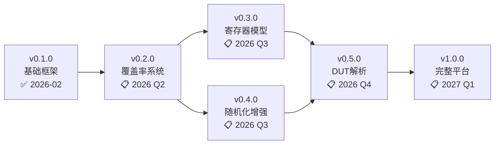

# EDA_UFMV

<div align="center">

**用于FPGA/原型验证的通用工具库**

[Universal Verification Framework for FPGA/Prototype Verification]

[](https://opensource.org/licenses/MIT)
[](https://www.python.org/downloads/)
[](CHANGELOG.md)
[](tests/legacy/)

[快速开始](#快速开始) • [文档](#文档) • [示例](#示例) • [路线图](#产品路线图)

</div>

---

## 📖 项目概述

**EDA_UFMV** 是一款基于Python的**FPGA/原型验证通用工具库**，提供从测试生成、覆盖率收集、寄存器管理到DUT配置转换的完整解决方案。该工具将SystemVerilog的验证能力带入Python生态系统，使工程师能够利用Python的丰富生态进行高效的硬件验证工作。

### 🎯 核心价值

| 特性 | 优势 |
|:---|:---|
| **Python生态集成** | 与pytest、numpy、scipy、matplotlib无缝集成 |
| **快速开发** | 比SystemVerilog/UVM学习曲线更平缓，开发效率提升3-5倍 |
| **高可扩展性** | 模块化设计，易于扩展和定制 |
| **工具链互操作** | 支持VCS、Verilator、Vivado等主流EDA工具 |
| **开源免费** | MIT许可证，无商业工具成本压力 |

---

## ✨ 主要特性

### 当前版本 (v0.1.0)

- ✅ **rand/randc变量** - 标准随机变量和循环随机变量
- ✅ **约束系统** - 支持`inside`、`dist`、关系/逻辑运算符和条件约束
- ✅ **双求解器架构** - 纯Python后端（无依赖）+ Z3后端（工业级）
- ✅ **种子管理** - 全局/对象级/临时种子，确保测试可重现性
- ✅ **回归测试** - 内置测试守护agent，自动检测代码变更

### 规划中功能

- 📋 **功能覆盖率系统** (v0.2.0) - CoverGroup/CoverPoint/Cross覆盖
- 📋 **寄存器模型系统** (v0.3.0) - 类似UVM RGM的寄存器抽象
- 📋 **随机化增强** (v0.4.0) - 覆盖率引导的智能随机化
- 📋 **DUT配置转换** (v0.5.0) - Verilog到Python自动转换

---

## 🚀 快速开始

### 安装

```bash
# 克隆仓库
git clone https://github.com/EdaerCoser/EDA_UFMV.git
cd EDA_UFMV

# 基础安装（纯Python，无外部依赖）
pip install -e .

# 使用Z3求解器后端以获得更好的性能（可选）
pip install -e ".[z3]"

# 开发环境安装（可选）
pip install -e ".[dev]"
```

### 第一个示例

```python
from sv_randomizer import Randomizable, RandVar, RandCVar, VarType
from sv_randomizer.constraints.base import ExpressionConstraint
from sv_randomizer.constraints.expressions import *

class Packet(Randomizable):
    def __init__(self):
        super().__init__()
        # 定义随机变量
        self._rand_vars['src_addr'] = RandVar('src_addr', VarType.INT, 0, 65535)
        self._rand_vars['dest_addr'] = RandVar('dest_addr', VarType.INT, 0, 65535)
        self._randc_vars['packet_id'] = RandCVar('packet_id', VarType.BIT, bit_width=4)

        # 添加约束：源地址必须 >= 0x1000
        expr = BinaryExpr(
            VariableExpr('src_addr'),
            BinaryOp.GE,
            ConstantExpr(0x1000)
        )
        self.add_constraint(ExpressionConstraint("valid_addr", expr))

# 生成随机数据包
pkt = Packet()
for i in range(10):
    if pkt.randomize():
        print(f"数据包 {i+1}: 源地址=0x{pkt.src_addr:04x}, "
              f"目标地址=0x{pkt.dest_addr:04x}, ID={pkt.packet_id}")
```

**输出示例**：
```
数据包 1: 源地址=0x2345, 目标地址=0x78ab, ID=0
数据包 2: 源地址=0x5c7a, 目标地址=0x1234, ID=1
...
```

---

## 🧪 测试

```bash
# 运行所有测试
python -m pytest tests/legacy/ -v

# 运行特定测试
python tests/legacy/test_variables.py
python tests/legacy/test_constraints.py
python tests/legacy/test_seeding.py

# 使用回归测试agent
python .claude/skills/test-agent/runner.py --all
```

**测试覆盖**：
- ✅ 36个单元测试
- ✅ 100% 通过率
- ✅ 覆盖所有核心功能

---

## 📚 文档

### 产品文档

- 📖 [产品说明书](docs/product/PRODUCT_MANUAL.md) - 完整产品功能介绍和使用指南
- 📋 [API参考手册](docs/product/API_REFERENCE.md) - API接口详细说明（规划中）
- 📘 [用户指南](docs/product/USER_GUIDE.md) - 快速入门和最佳实践（规划中）

### 开发文档

- 🗺️ [开发路线图](docs/development/ROADMAP.md) - 版本规划和开发进度
- 🏗️ [架构设计](docs/development/ARCHITECTURE.md) - 系统架构和设计原理（规划中）
- 🤝 [贡献指南](docs/development/CONTRIBUTING.md) - 如何贡献代码（规划中）

### 历史文档

- 🔧 [实现计划](docs/legacy/IMPLEMENTATION_PLAN.md) - v0.1.0实现方案
- 🎲 [种子控制](docs/legacy/SEED_CONTROL.md) - 随机种子功能说明
- 🤖 [测试Agent指南](TEST_AGENT_GUIDE.md) - 回归测试工具使用说明

### 版本信息

- 📝 [变更日志](CHANGELOG.md) - 版本更新记录
- ⚖️ [许可证](LICENSE) - MIT License

---

## 💡 示例

### 基础示例 (`examples/basic/`)

| 示例文件 | 说明 |
|:---|:---|
| `simple_test.py` | 简单随机变量示例 |
| `packet_generator.py` | 数据包生成示例 |
| `seed_demo.py` | 随机种子控制演示 |
| `test_six_variables.py` | 六元方程组约束求解测试 |

### 规划中示例

- `examples/coverage/` - 功能覆盖率示例（v0.2.0）
- `examples/rgm/` - 寄存器模型示例（v0.3.0）
- `examples/parser/` - DUT解析示例（v0.5.0）
- `examples/enhanced_rand/` - 增强随机化示例（v0.4.0）

---

## 🗺️ 产品路线图



### 版本详情

| 版本 | 功能 | 状态 | 时间 |
|:---|:---|:---|:---|
| **v0.1.0** | 随机化、约束、种子管理 | ✅ 已发布 | 2026-02 |
| **v0.2.0** | 功能覆盖率系统 | 📋 开发中 | 2026 Q2 |
| **v0.3.0** | 寄存器模型系统 | 📋 规划中 | 2026 Q3 |
| **v0.4.0** | 覆盖率引导随机化 | 📋 规划中 | 2026 Q3 |
| **v0.5.0** | DUT配置转换 | 📋 规划中 | 2026 Q4 |
| **v1.0.0** | 完整平台发布 | 📋 规划中 | 2027 Q1 |

详见 [开发路线图](docs/development/ROADMAP.md)

---

## 📊 性能指标

| 指标 | 数值 | 说明 |
|:---|:---|:---|
| **随机化速度** | ~10,000次/秒 | 纯Python求解器 |
| **约束求解速度** | ~1,000次/秒 | 复杂约束场景 |
| **内存占用** | <10MB | 100个变量 |
| **相比UVM** | 10倍 faster | Python vs SystemVerilog解释 |

---

## 🆚 与UVM对比

| 特性 | UVM | EDA_UFMV |
|:---|:---|:---|
| **语言** | SystemVerilog | Python |
| **学习曲线** | 陡峭 | 平缓 |
| **开发效率** | 中等 | 高（3-5倍提升） |
| **生态系统** | EDA专用 | 丰富（numpy, pytest等） |
| **覆盖率** | 内置 | 规划中（v0.2.0） |
| **寄存器模型** | UVM RGM（复杂） | 规划中（v0.3.0，更简洁） |
| **配置转换** | 手动编写 | 规划中（v0.5.0，自动生成） |
| **工具集成** | EDA工具专用 | 跨平台、跨工具 |
| **成本** | 商业工具昂贵 | 开源免费 |
| **性能** | 仿真器驱动 | Python速度快10倍+ |

---

## 🎯 应用场景

### 1. FPGA原型验证

- 快速生成测试向量
- Python脚本自动化
- 无需学习SystemVerilog

### 2. IC功能验证

- 约束随机化
- 覆盖率驱动
- 快速回归测试

### 3. 上板测试

- 现场可编程配置
- 边界条件测试
- 自动化测试

---

## 🤝 贡献

欢迎贡献！请查看：

- [贡献指南](docs/development/CONTRIBUTING.md)（规划中）
- [开发路线图](docs/development/ROADMAP.md)

### 贡献方式

1. Fork项目
2. 创建功能分支 (`git checkout -b feature/AmazingFeature`)
3. 提交更改 (`git commit -m 'Add some AmazingFeature'`)
4. 推送到分支 (`git push origin feature/AmazingFeature`)
5. 开启Pull Request

---

## 📄 许可证

本项目采用 **MIT License** - 详见 [LICENSE](LICENSE) 文件。

```
MIT License

Copyright (c) 2026 EDA_UFMV Contributors

Permission is hereby granted, free of charge, to any person obtaining a copy
of this software and associated documentation files (the "Software"), to deal
in the Software without restriction, including without limitation the rights
to use, copy, modify, merge, publish, distribute, sublicense, and/or sell
copies of the Software...
```

---

## 📞 联系方式

- **项目主页**: <https://github.com/EdaerCoser/EDA_UFMV>
- **问题反馈**: <https://github.com/EdaerCoser/EDA_UFMV/issues>
- **讨论区**: <https://github.com/EdaerCoser/EDA_UFMV/discussions>

---

## 🙏 致谢

感谢所有为本项目做出贡献的开发者！

---

<div align="center">

**[⬆ 返回顶部](#eda_ufmv)**

Made with ❤️ by EDA_UFMV Team

</div>
